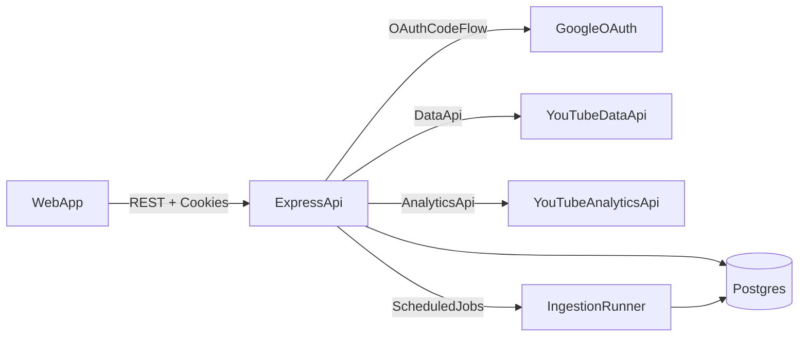
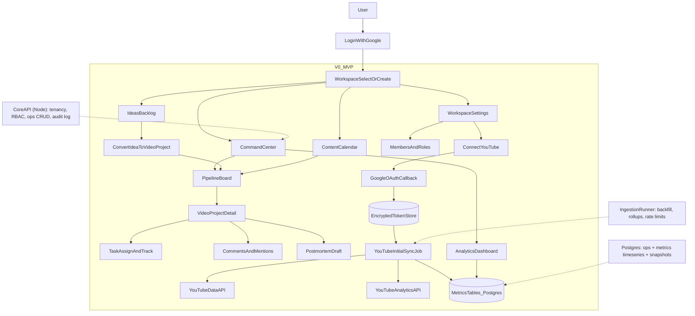

## Goals (MVP)

- **Ops command center** for a creator org: workspaces, roles, video pipeline (kanban), ideas, tasks, calendar, comments, activity feed, audit log.
- **Real YouTube metrics**: Google OAuth → connect a channel → ingest key metrics (views, impressions, CTR, watch time, retention summary where available) into Postgres → power dashboards.
- **Fast, demo-ready UX**: modern UI with Tailwind + shadcn/tweakcn, seeded demo data, and one-click “connect YouTube” flow.

## Tech stack (opinionated, fast to ship)

- **Monorepo**: `apps/api` (Node + Express), `apps/web` (React + Vite).
- **Language**: JavaScript (no TypeScript) across web + API.
- **DB**: Postgres + Prisma migrations.
- **Auth**: Google OAuth 2.0 (server-side code flow), signed HTTP-only session cookies.
- **YouTube**: `googleapis` (YouTube Data API v3 + YouTube Analytics API).
- **Jobs**: scheduled ingestion using a lightweight worker (initially in `apps/api`), later split to `apps/worker`.
- **UI**: Tailwind, shadcn/ui, tweakcn theme, TanStack Query, React Hook Form + Zod, dnd-kit for kanban.
- **Python (ML microservices)**: FastAPI for inference APIs; Celery + Redis for batch scoring/training (Phase 3).

## Folder structure (monorepo)

```
BeastOps/
  apps/
    api/
      prisma/
        schema.prisma
        migrations/
      src/
        server.js
        config/
        db/
        middlewares/
        routes/
          index.js
        controllers/
          workspace.controller.js
          pipeline.controller.js
          video.controller.js
          idea.controller.js
          task.controller.js
          comment.controller.js
          analytics.controller.js
          youtube.controller.js
        services/
          workspace.service.js
          pipeline.service.js
          youtube.service.js
          analytics.service.js
          audit.service.js
        auth/
          auth.routes.js
          oauth.controller.js
          oauth.service.js
          session.service.js
        jobs/
          youtubeSync.job.js
        utils/
      test/
    web/
      src/
        app/
          router.jsx
          providers/
        pages/
          CommandCenter/
            index.jsx
            components.jsx
            hooks.js
          Pipeline/
            index.jsx
            components/
          Video/
            index.jsx
          Ideas/
            index.jsx
          Tasks/
            index.jsx
          Calendar/
            index.jsx
          Analytics/
            index.jsx
          Settings/
            index.jsx
        components/
          ui/          # shadcn/ui primitives
          layout/
          common/
        features/
          pipeline/
          analytics/
        hooks/
        utils/
        lib/
          api.js
          auth.js
      public/
  services/
    ml/
      src/
        main.py        # FastAPI entry
        api/
        models/
        pipelines/
      tests/
  packages/
    shared/
      src/
        contracts/
        validators/
  infra/
    docker/
    scripts/
  docs/
    architecture.md
    demo-script.md
  docker-compose.yml
  .env.example
  README.md
```

## Backend structure (controllers/services/routes)

- **Routes** (`apps/api/src/routes/**`): define URLs + middleware chain; call controllers.
- **Controllers** (`apps/api/src/controllers/**`): validate inputs, enforce workspace scoping, call services, shape responses.
- **Services** (`apps/api/src/services/**`): business logic + orchestration (DB + external APIs).
- **Jobs** (`apps/api/src/jobs/**`): background/scheduled work (YouTube ingestion).

## Data model (minimum viable)

- **Tenancy/RBAC**
  - `User`, `Workspace`, `WorkspaceMember` (role: Admin/Creator/Editor/Analyst/Finance/Viewer)
- **Ops objects**
  - `VideoProject` (one “video” record)
  - `PipelineStage` (Idea/Script/Filming/Editing/Review/Upload/Postmortem)
  - `Idea` (hook, title concepts, thumb concepts, tags, expected range)
  - `Task` (assignee, due date, status)
  - `Comment` (on `VideoProject`/`Task`)
  - `AuditEvent` (actor, action, entity, before/after summary)
- **YouTube connection + metrics**
  - `OAuthAccount` (Google tokens encrypted-at-rest)
  - `Channel`, `Video` (YT IDs + metadata)
  - `MetricTimeseries` (daily metrics by video)
  - `MetricSnapshot` (latest rollups for fast dashboards)

## API surface (MVP)

- **Auth**: `GET /auth/google`, `GET /auth/google/callback`, `POST /auth/logout`, `GET /me`
- **Workspaces**: CRUD, member invites (simple link-based invite to start)
- **Pipeline**: list stages, list video projects, move card between stages, update metadata
- **Ideas/Tasks**: CRUD, assign, due dates
- **Collab**: comments, activity feed, audit trail
- **YouTube**: connect workspace → select channel → trigger initial sync; endpoints for dashboard queries

## UI (MVP screens)

- **Login / Workspace switcher**
- **Command Center** (overview KPIs + “what needs attention”)
- **Pipeline board** (kanban with drag/drop)
- **Video project detail** (metadata, tasks, comments, audit)
- **Ideas** (table + filters)
- **Calendar** (tasks + pipeline milestones; simple month/list view)
- **Analytics**
  - channel overview
  - per-video performance (views, CTR, impressions, watch time)
  - time-series charts + compare two videos
- **Settings** (members/roles + YouTube connect status)

## YouTube ingestion approach (MVP)

- **OAuth scopes**: minimal required for Analytics + Data read.
- **Initial sync**: pull recent videos (e.g., last 90 days), then backfill daily metrics per video.
- **Ongoing sync**: scheduled job (hourly/daily) updates `MetricSnapshot` and appends new daily points.
- **Rate-limit handling**: exponential backoff + checkpointing.

## Architecture diagram



## User-facing flow (detailed)



## Implementation notes (to keep MVP solid)

- **Sessions**: HTTP-only cookie; CSRF protection for state-changing endpoints.
- **Token storage**: encrypt refresh/access tokens using an app-level key; never store raw tokens in logs.
- **RBAC**: middleware checks by `WorkspaceMember.role` for each route.
- **Performance**: dashboards read from `MetricSnapshot` + indexed timeseries tables.

## 3-phase plan (scope split)

### Phase 1 — MVP (ship fast, demo-ready, real data)

- Workspaces + RBAC + audit log
- Pipeline kanban + video projects + tasks + comments + calendar
- YouTube OAuth + real ingestion (recent videos + daily metrics backfill) + basic dashboards
- Seed/demo dataset + demo script

### Phase 2 — Remaining scope (core product completeness)

- **Experimentation engine**: thumbnail/title variants, traffic splits, winner selection rules, experiment history
- **Deeper analytics**: retention drop-off views, traffic source breakdown, benchmarking vs channel averages, comparative analytics at scale
- **ROI & budgets**: estimated vs actual budgets, cost-per-view, CPMV, category ROI, finance-friendly reports
- **Operational workflow**: review states, approvals, stronger calendar planning, richer postmortem templates + insight tags
- **Integrations**: webhook ingest endpoints for external metrics; more robust sync management UI

### Phase 3 — Additional features (nice-to-haves / differentiation)

- **ML recommendations (Python services)**: title/thumb suggestions, predictive pre-upload scoring, best-format detection
- **Real-time**: spike detection, alerting (Slack/email), action suggestions
- **Cross-platform**: Shorts/TikTok/Instagram analytics
- **Automation**: highlight detection, automated calendar optimization, audience segmentation insights
- **Knowledge base**: semantic search across postmortems + insights; playbooks

## Delivery checklist (definition of done)

- MVP deployable (web + api + db) with seed data.
- Google OAuth connects and ingests real metrics for a selected channel.
- Pipeline/ideas/tasks/calendar usable end-to-end with audit log.
- Demo script prepared (5–7 minutes) showing: create workspace → invite → plan video → connect YouTube → compare video performance.

